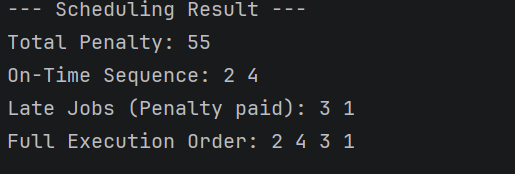
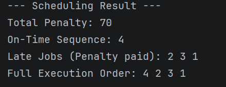
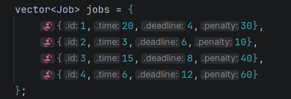
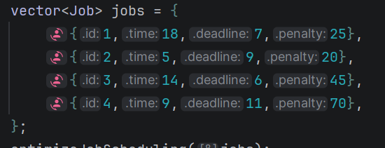
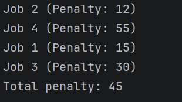
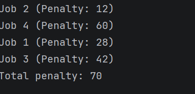
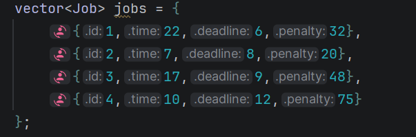

# **Advanced Algorithms and Complexity**
## **Course Code: CSE245**

---

### **Ain Shams University**
**Faculty of Engineering**  
**CAIE Program (Computer and Artificial Intelligence Engineering)**

---

## **Course Information**

- **Course Title:** Advanced Algorithms and Complexity
- **Course Code:** CSE245
- **Academic Year:** 2025 / 2026
- **Semester:** _spring 2026_
- **Instructor:** _Contacts
  Lecturer: _Prof. Dr. Gamal A. Ebrahim / Eng. Sally E. Shaker_
---

## **Group Members**

| Name | Student ID |
|------|------------|
|      |            |
|      |            |
|      |            |
|      |            |
|      |            |
|      |            |
|      |            |
|      |            |
|      |            |
|      |            |

---

## **Submission Date**
_(Insert date)_  
\newpage
# Task01 – _(Insert Description)_

\newpage
# Task02 – _(Insert Description)_

\newpage
# Task03 – _(Insert Description)_

\newpage
# Task04 – _(Insert Description)_

\newpage
# Task05 – _(Insert Description)_

\newpage
# Task06 – _(Insert Description)_

\newpage
# Task07 – _Minimizing Penalty in Single-Machine Job Scheduling_
## Task Description
A company must schedule $n$ jobs on a single machine. Each job $i$ has:
- A processing time $t_i$
- A deadline $d_i$
- A penalty $p_i$ incurred if the job is completed after its deadline $d_i$.

The goal is to find an execution order that minimizes the total penalty incurred.

## Underlying Assumptions
1. **Single Machine:** Only one job can be processed at any given time.
2. **Non-preemption:** Once a job starts, it must be completed without interruption.
3. **Constant Penalty:** The penalty $p_i$ is a fixed value and does not depend on how late the job is, as long as it finishes after $d_i$.
4. **All jobs available:** All jobs are available at time $t=0$.

## Solution
### Brute Force Method
The brute force approach generates all possible $n!$ permutations of the jobs and calculates the total penalty for each. The permutation with the minimum penalty is selected.

#### Pseudocode
```text
Procedure BruteForce(current_permutation, available_jobs):
    if available_jobs is empty:
        penalty = CalculatePenalty(current_permutation)
        if penalty < min_penalty:
            min_penalty = penalty
            best_order = current_permutation
        return

    for each job in available_jobs:
        new_permutation = current_permutation + job
        remaining_jobs = available_jobs - job
        BruteForce(new_permutation, remaining_jobs)

Procedure CalculatePenalty(jobs):
    current_time = 0
    total_penalty = 0
    for each job in jobs:
        current_time += job.time
        if current_time > job.deadline:
            total_penalty += job.penalty
    return total_penalty
```

#### Implementation Code
```cpp
static int calculatePenalty(const std::vector<Job> &jobs) {
    int time = 0;
    int totalPenalty = 0;
    for(auto& job : jobs)
    {
        time += job.time;
        if (time > job.deadline)totalPenalty+=job.penalty;
    }
    return totalPenalty;
}

void BFHelper(const std::vector<Job>& jobs,
                             std::vector<Job>& current,
                             std::vector<bool>& used,
                             Result& best){
    if (current.size()== jobs.size()) {
        if (const int totalPenalty = calculatePenalty(current); totalPenalty < best.totalPenalty)
        {
            best.totalPenalty = totalPenalty;
            best.bestOrder = current;
        }
        return ;
    }
    for (size_t i = 0; i < jobs.size(); i++) {
        if (used[i])continue;
        used[i] = true;
        current.push_back(jobs[i]);
        BFHelper(jobs,current,used,best);
        current.pop_back();
        used[i] = false;
    }
}
```

#### Step By Step Description
1. Start with an empty sequence and a set of all jobs.
2. Recursively pick one job from the set and add it to the sequence.
3. Once a full sequence of $n$ jobs is formed, calculate the completion time for each job.
4. If a job's completion time exceeds its deadline, add its penalty to the total.
5. Track the sequence that yields the minimum total penalty.

#### Time and Space Complexity Analysis
- **Time Complexity:** $O(n \cdot n!)$, where $n!$ is the number of permutations and $O(n)$ is the time to calculate the penalty for each.
- **Space Complexity:** $O(n)$ for the recursion stack and storing the current permutation.

#### Test Cases
##### Test Case 1: 
**Input:**  
  
**Output:**  

##### Test Case 2:
**Input:**  
  
**Output:**  

##### Test Case 3:
**Input:**  
  
**Output:**   

##### Test Case 4:
**Input:**  
  
**Output:**  

### Dynamic Programming Method
We first sort the jobs by their deadlines (Earliest Deadline First – EDF). We define $dp[i][t]$ as the minimum penalty incurred when considering the first $i$ jobs, and they finish by time $t$.

#### Pseudocode
```text
Sort jobs by deadline d_i
TotalTime = sum of all t_i
Initialize DP[n+1][TotalTime+1] with 0

for i from 1 to n:
    for t from 0 to TotalTime:
        // Option 1: Job i is late (Penalty incurred)
        skipPenalty = jobs[i-1].penalty + DP[i-1][t]
        
        // Option 2: Job i is on time (Must finish by d_i and current time t)
        doPenalty = Infinity
        if t >= jobs[i-1].time AND t <= jobs[i-1].deadline:
            doPenalty = DP[i-1][t - jobs[i-1].time]
            
        DP[i][t] = min(skipPenalty, doPenalty)
        if t > 0:
            DP[i][t] = min(DP[i][t], DP[i][t-1])
```

#### Implementation Code
```cpp
void optimizeJobScheduling(vector<Job>& jobs)
{
    sort(jobs.begin(), jobs.end());
    int total_time=0;
    for(const auto j: jobs)total_time+=j.time;
    vector dp{size + 1, vector<int>(total_time + 1, 0)};
    for (int i = 1; i <= size; ++i) {
        const int p_i = jobs[i-1].penalty;
        const int t_i = jobs[i-1].time;
        const int d_i = jobs[i-1].deadline;
        for (int t = 0; t <= total_time; ++t) {
            int skipPenalty = p_i + dp[i-1][t];
            int doPenalty = 2e9;
            if (t >= t_i && t <= d_i) {
                doPenalty = dp[i-1][t - t_i];
            }
            dp[i][t] = min(doPenalty,skipPenalty);
            if (t > 0) dp[i][t] = min(dp[i][t], dp[i][t-1]);
        }
    }
}
```

#### Step By Step Description
1. Sort jobs by deadline.
2. Build a table where each row represents a job and each column represents the time.
3. For each cell, decide whether to include the job in the "on-time" set (if time allows) or the "late" set.
4. The value in each cell represents the minimum penalty for that state.
5. Backtrack from the bottom-right of the table to find which jobs were scheduled on-time.

#### Time and Space Complexity Analysis
- **Time Complexity:** $O(n \cdot \sum t_i)$, where $n$ is the number of jobs and $\sum t_i$ is the total processing time.
- **Space Complexity:** $O(n \cdot \sum t_i)$ to store the DP table.

#### Test Cases
##### Test Case 1  
**Input:**   
   
**Output:**  

##### Test Case 2
**Input:**  
  
**Output:**  

##### Test Case 3
**Input:**  
  
**Output:**  

##### Test Case 4
**Input:**  
  
**Output:**  


### Divide & Conquer Method
This problem is solved using a recursive backtracking approach (a form of state-space search) that divides the problem into subproblems: for each job, we either process it on-time or we process it late.

#### Pseudocode
```text
Procedure Solve(index, currentTime, currentSavedPenalty):
    if index == n:
        if currentSavedPenalty > maxSaved:
            maxSaved = currentSavedPenalty
        return

    // Option 1: Job is late
    Solve(index + 1, currentTime, currentSavedPenalty)

    // Option 2: Job is on-time (if possible)
    if currentTime + jobs[index].time <= jobs[index].deadline:
        Solve(index + 1, currentTime + jobs[index].time, currentSavedPenalty + jobs[index].penalty)
```

#### Implementation Code
```cpp
static void DCHelper( vector<Job>& jobs,
    const int i,
    const int currentTime,
    const int savedPenalty,
    vector<char>& currentTake,
    const int remainingPenaltySum,
    DCState& state) {
    if (savedPenalty + remainingPenaltySum <= state.bestSavedPenalty)return;
    if (i == static_cast<int>(jobs.size())) {
        if (savedPenalty>state.bestSavedPenalty) {
            state.bestSavedPenalty = savedPenalty;
            state.bestTake = currentTake;
        }
        return;
    }
    // Option 1: skip job i -> late
    currentTake[i]=0;
    DCHelper(jobs,i+1,currentTime,savedPenalty,currentTake,remainingPenaltySum-jobs[i].penalty,state);
    
    // Option 2: take job i on time if the deadline allows
    if (currentTime+jobs[i].time <= jobs[i].deadline) {
        currentTake[i] = 1;
        DCHelper(jobs, i+1, currentTime+jobs[i].time, savedPenalty+jobs[i].penalty, 
                 currentTake, remainingPenaltySum-jobs[i].penalty, state);
    }
}
```

#### Step By Step Description
1. Sort jobs by deadline (EDF).
2. Recursively explore two branches for each job: include in on-time set or exclude.
3. Prune branches where the potential saved penalty cannot exceed the current best.
4. When all jobs are considered, update the global maximum saved penalty.
5. Total penalty = (Sum of all penalties) - (Maximum saved penalty).

#### Time and Space Complexity Analysis
- **Time Complexity:** $O(2^n)$ in the worst case (unpruned binary tree).
- **Space Complexity:** $O(n)$ for the recursion stack.

#### Test Cases
##### Test Case 1
**Input:**   
  
**Output:**  
  
##### Test Case 2
**Input:**  
  
**Output:**  

##### Test Case 3
**Input:**  
  
**Output:**  

##### Test Case 4  
**Input:**  
  
**Output:**  

## Comparative Evaluation
| Feature        | Brute Force                | Dynamic Programming          | Divide & Conquer (Backtracking) |
|:---------------|:---------------------------|:-----------------------------|:--------------------------------|
| **Optimality** | Guaranteed                 | Guaranteed                   | Guaranteed                      |
| **Efficiency** | Very Low ($O(n \cdot n!)$) | High ($O(n \cdot \sum t_i)$) | Medium ($O(2^n)$)               |
| **Best For**   | Very small $n$ ($n < 10$)  | Small $t_i$, larger $n$      | Medium $n$, high $t_i$          |
| **Complexity** | Simple                     | Moderate                     | Moderate                        |

## Extended Analysis & Alternative techniques
- **Greedy approach:** While a simple greedy approach (e.g., sorting by penalty) doesn't always yield the optimal solution, it can be used for approximation.
- **Moore-Hodgson Algorithm:** An $O(n \log n) $ algorithm specifically designed for minimizing the number of late jobs (when all penalties are equal).
- **Branch and Bound:** Can significantly improve the performance of the backtracking approach by using more sophisticated pruning.

## Key Findings and Insights
1. **EDF Sorting:** Sorting jobs by their deadlines is a crucial preprocessing step for both DP and recursive approaches in this problem.
2. **Penalty vs. Time:** The DP approach's efficiency is highly dependent on the total processing time, making it a "pseudo-polynomial" time algorithm.
3. **Pruning Effectiveness:** In the Divide & Conquer (Backtracking) approach, effective pruning can drastically reduce the search space, making it viable for larger $n$ than pure brute force.
\newpage
# Task08 – _(Insert Description)_

\newpage
# Task09 – _(Insert Description)_

\newpage
# Task10 – _(Insert Description)_
\newpage
# References
[1] Moore, J. M. (1968). An n job, one machine sequencing algorithm for minimizing the number of late jobs. Management Science.
