# **Advanced Algorithms and Complexity**
## **Course Code: CSE245**

---

### **Ain Shams University**
**Faculty of Engineering**  
**CAIE Program (Computer and Artificial Intelligence Engineering)**

---

## **Course Information**

- **Course Title:** Advanced Algorithms and Complexity
- **Course Code:** CSE245
- **Academic Year:** 2025 / 2026
- **Semester:** _spring 2026_
- **Instructors:** _Prof. Dr. Gamal A. Ebrahim / Eng. Sally E. Shaker_
---

## **Group Members**

| Name | Student ID | Name | Student ID |
|------|------------|------|------------|
|      |            |      |            |
|      |            |      |            |
|      |            |      |            |
|      |            |      |            |
|      |            |      |            |

---

## **Submission Date**
_(Insert date)_  

# Task01 – _(Insert Description)_


# Task02 – _(Insert Description)_


# Task03 – Tower of Hanoi with Four Pegs (Frame-Stewart)
## Task Description
There are eight disks of different sizes and four pegs. Initially, all disks are stacked on the first peg in order of size, with the largest on the bottom and the smallest on top. The objective is to transfer all disks to another peg using a sequence of moves, where only one disk may be moved at a time and it is forbidden to place a larger disk on top of a smaller one.
 
The task asks whether a Dynamic Programming algorithm can solve this puzzle in 33 moves for $n = 8$ disks. If not, an algorithm that achieves 33 moves must be designed. Additionally, a general Dynamic Programming algorithm must be designed to solve the four-peg puzzle for any number of disks.
 
## Underlying Assumptions
1. Only one disk may be moved per step.
2. A larger disk may never be placed on top of a smaller disk.
3. Any peg may serve as a temporary auxiliary at any point.
4. The four-peg variant strictly generalises the classic three-peg problem; three-peg Hanoi is used as a sub-routine within the four-peg solution.
5. The Frame-Stewart conjecture is assumed to give the optimal move count (it has been verified for small $n$ including $n = 8$).
## Solution
 
### Divide and Conquer Method
The classic three-peg Tower of Hanoi is solved by divide and conquer. To move $n$ disks from the source peg to the destination peg using one auxiliary peg:
 
1. Recursively move the top $n-1$ disks from source to auxiliary.
2. Move the largest disk from source to destination.
3. Recursively move $n-1$ disks from auxiliary to destination.
This yields the recurrence $T(n) = 2T(n-1) + 1$, which solves to $T(n) = 2^n - 1$. For $n = 8$ disks this gives $2^8 - 1 = 255$ moves.
 
#### Pseudocode
```text
Procedure Hanoi3Peg(n, source, destination, aux):
    if n == 0: return
    Hanoi3Peg(n-1, source, aux, destination)
    move disk n from source to destination
    Hanoi3Peg(n-1, aux, destination, source)
```
 
#### Implementation Code
```cpp
void hanoi3Peg(int n, char source, char destination, char aux)
{
    if (n == 0)
        return;
 
    hanoi3Peg(n - 1, source, aux, destination);
    cout << "Move disk " << n << " from Peg " << source << " to Peg " << destination << "\n";
    totalMoves++;
    hanoi3Peg(n - 1, aux, destination, source);
}
```
 
#### Step By Step Description
1. If there is only one disk, move it directly from source to destination.
2. Recursively move the top $n-1$ disks out of the way onto the auxiliary peg.
3. Move the bottom (largest) disk to the destination peg.
4. Recursively move the $n-1$ disks from the auxiliary peg onto the destination peg.
#### Time and Space Complexity Analysis
- **Time Complexity:** $O(2^n)$ — the recurrence $T(n) = 2T(n-1) + 1$ solves to $2^n - 1$.
- **Space Complexity:** $O(n)$ for the recursion stack depth.
---
 
### Dynamic Programming Method (Frame-Stewart Algorithm)
The fourth peg is exploited by the Frame-Stewart algorithm. To move $n$ disks using four pegs, choose a split parameter $k$ ($1 \leq k < n$):
 
1. Use all four pegs to move the top $k$ disks to an auxiliary peg.
2. Use three pegs (ignoring the peg holding the $k$ disks) to move the remaining $n - k$ disks to the destination — this costs $2^{n-k} - 1$ moves.
3. Use all four pegs to move the $k$ disks from the auxiliary onto the destination.
The total cost for a given $k$ is $2 \cdot dp[k] + (2^{n-k} - 1)$. The DP table selects the $k$ that minimises this:
 
$$dp[n] = \min_{1 \leq k < n} \left( 2 \cdot dp[k] + 2^{n-k} - 1 \right)$$
 
with base cases $dp[0] = 0$ and $dp[1] = 1$.
 
#### Pseudocode
```text
Procedure BuildDPTable(maxDisks):
    dp[0] = 0
    dp[1] = 1
    bestSplit[0] = 0
    bestSplit[1] = 0
 
    for n from 2 to maxDisks:
        dp[n] = INFINITY
        for k from 1 to n-1:
            cost = 2 * dp[k] + (2^(n-k) - 1)
            if cost < dp[n]:
                dp[n] = cost
                bestSplit[n] = k
 
Procedure Hanoi4Peg(n, source, destination, aux1, aux2):
    if n == 0: return
    if n == 1:
        move disk 1 from source to destination
        return
    k = bestSplit[n]
    Hanoi4Peg(k,   source, aux1,        destination, aux2)
    Hanoi3Peg(n-k, source, destination, aux2)
    Hanoi4Peg(k,   aux1,   destination, source,      aux2)
```
 
#### Implementation Code
```cpp
void buildDPTable(int maxDisks)
{
    dp[0] = 0;
    dp[1] = 1;
    bestSplit[0] = 0;
    bestSplit[1] = 0;
 
    for (int n = 2; n <= maxDisks; n++)
    {
        dp[n] = INT_MAX;
 
        for (int k = 1; k < n; k++)
        {
            int cost = 2 * dp[k] + ((1 << (n - k)) - 1);
 
            if (cost < dp[n])
            {
                dp[n]        = cost;
                bestSplit[n] = k;
            }
        }
    }
}
 
void hanoi4Peg(int n, char source, char destination, char aux1, char aux2)
{
    if (n == 0)
        return;
 
    if (n == 1)
    {
        cout << "Move disk 1 from Peg " << source << " to Peg " << destination << "\n";
        totalMoves++;
        return;
    }
 
    int k = bestSplit[n];
 
    hanoi4Peg(k, source, aux1, destination, aux2);
    hanoi3Peg(n - k, source, destination, aux2);
    hanoi4Peg(k, aux1, destination, source, aux2);
}
```
 
#### Step By Step Description
1. Build the DP table by evaluating every possible split $k$ for each disk count from 2 up to $n$.
2. Store the optimal split $k$ in `bestSplit[n]` for use during the actual move sequence.
3. To execute the four-peg solution for $n$ disks, retrieve $k = \text{bestSplit}[n]$.
4. Recursively move the top $k$ disks to a spare peg using all four pegs.
5. Move the remaining $n - k$ disks to the destination using only three pegs (classic Hanoi).
6. Recursively move the $k$ disks from the spare peg to the destination using all four pegs.
#### Time and Space Complexity Analysis
- **Time Complexity (table construction):** $O(n^2)$ — two nested loops each of size $n$.
- **Time Complexity (move execution):** $O(dp[n])$, i.e. proportional to the number of moves produced, which is $O(n^{1.5})$ empirically under the Frame-Stewart formula.
- **Space Complexity:** $O(n)$ for the `dp` and `bestSplit` arrays, plus $O(n)$ recursion depth.
#### DP Table Output ($n = 8$)
 
| Disks | Best $k$ | Min Moves |
|-------|----------|-----------|
| 1     | 0        | 1         |
| 2     | 1        | 3         |
| 3     | 1        | 5         |
| 4     | 1        | 9         |
| 5     | 2        | 13        |
| 6     | 3        | 17        |
| 7     | 3        | 25        |
| 8     | 4        | 33        |
 
The DP confirms that 8 disks can be transferred in **33 moves** using 4 pegs — compared to the 255 moves required by the classic three-peg divide and conquer approach.
 
## Comparative Evaluation
 
| Feature            | 3-Peg Divide & Conquer     | 4-Peg Dynamic Programming (Frame-Stewart) |
|:-------------------|:---------------------------|:------------------------------------------|
| **Optimality**     | Optimal for 3 pegs         | Conjectured optimal for 4 pegs            |
| **Move Count**     | $2^n - 1$                  | $O(n^{1.5})$ empirically                  |
| **For $n = 8$**    | 255 moves                  | 33 moves                                  |
| **Approach**       | Pure recursion             | DP table + recursive execution            |
| **Time Complexity**| $O(2^n)$                   | $O(n^2)$ build + $O(dp[n])$ execution     |
| **Generality**     | Any $n$, fixed 3 pegs      | Any $n$, generalises to $p$ pegs          |
 
## Extended Analysis & Alternative Techniques
- **Frame-Stewart conjecture:** The algorithm is conjectured to be optimal for four pegs, and has been verified computationally for all $n \leq 30$, including $n = 8$.
- **Generalisation to $p$ pegs:** The same DP structure extends to any number of pegs $p \geq 3$. Adding more pegs reduces the move count further; the benefit diminishes as $p$ grows.
- **Three-peg as a sub-routine:** The four-peg solution deliberately falls back to three-peg Hanoi for the middle $n - k$ disks, showing how divide and conquer and dynamic programming compose naturally.
## Key Findings and Insights
1. The fourth peg enables a dramatic reduction from $2^n - 1$ moves to approximately $O(n^{1.5})$ moves, which for $n = 8$ is a reduction from 255 to 33 — a factor of almost 8.
2. The optimal split $k$ is not simply $\lfloor n/2 \rfloor$; it is determined by the DP minimisation and shifts as $n$ grows, highlighting that greedy or symmetric splits are suboptimal.
3. Combining classic divide and conquer (three-peg recursion) as a sub-routine inside a DP framework demonstrates that the two paradigms are complementary rather than competing.


# Task04 – _(Insert Description)_


# Task05 – _Shooting an Unseen Moving Target_
## Task Description
A computer game has a shooter and a moving target hiding in one of $n > 1$ hiding spots arranged on a straight line, indexed $1, 2, \dots, n$. The shooter never sees the target; the only known fact is that **between every two consecutive shots the target moves to an adjacent spot**. A shot kills the target if and only if it lands on the spot the target is currently at. The objective is to design a fixed sequence of shots (no feedback after each shot) that is **guaranteed to hit the target regardless of where it starts and how it moves**. The constraint is to design a Divide and Conquer algorithm; decrease and conquer is explicitly disallowed.

## Underlying Assumptions
1. Hiding spots are arranged on a 1D line and indexed by integers in $\{1, 2, \dots, n\}$.
2. A "move to an adjacent spot" means $x \to x-1$ or $x \to x+1$. The target cannot leave $[1, n]$, so a target at spot $1$ must move to $2$ and a target at spot $n$ must move to $n-1$.
3. The target moves exactly once after each shot that misses, and never between a shot and the same round's hit decision.
4. The shooter has no memory of past hits or misses (no feedback). The full shot sequence is fixed in advance.
5. The target may behave adversarially; it is allowed to pick whichever adjacent move best avoids future shots.

## Solution
### Divide and Conquer Method
**Key invariant.** Every move flips the target's parity (an even-indexed spot becomes odd, and vice versa). The parity of the spot occupied at round $k$ is therefore determined entirely by the **initial parity** and the round number; the target's initial parity is a game-long invariant.

**Divide.** Partition the set of all possible target trajectories into two disjoint sub-instances by initial parity:
- $A$: trajectories whose starting spot is **even**.
- $B$: trajectories whose starting spot is **odd**.

**Conquer.** Each sub-instance is solved by a parity-locked sweep of contiguous indices.
- Solving $A$: shoot $2, 3, 4, \dots, n-1$ in order. At round $k$ the shot is at spot $k+1$, whose parity equals the parity of an even-start target at round $k$. Bounded by the walls, the target cannot keep dodging forever and is hit somewhere in the sweep.
- Solving $B$: shoot $n-1, n-2, \dots, 3, 2$ in order. By the same parity argument, every shot in this sweep is parity-aligned with an odd-start target.

Each sweep itself is constructed recursively by halving the index range $[lo, hi]$ at $mid = \lfloor (lo+hi)/2 \rfloor$, recursing on the two halves, and concatenating in the desired direction. This is a clean binary divide and conquer structure rather than a decrease-and-conquer peel.

**Combine.** Concatenate the two sweep sequences. The final strategy has length $2(n-2)$ for $n \geq 3$. The case $n = 2$ is a base case: two shots at the same spot suffice.

#### Pseudocode
```text
Procedure BuildSweep(lo, hi, dir, out):
    if lo > hi: return
    if lo == hi:
        append lo to out
        return
    mid = (lo + hi) / 2
    if dir == +1:
        BuildSweep(lo,    mid, +1, out)
        BuildSweep(mid+1, hi,  +1, out)
    else:
        BuildSweep(mid+1, hi,  -1, out)
        BuildSweep(lo,    mid, -1, out)

Procedure GenerateShots(n):
    shots = []
    if n == 2: return [2, 2]
    BuildSweep(2, n-1, +1, shots)   // sub-instance A: even-start targets
    BuildSweep(2, n-1, -1, shots)   // sub-instance B: odd-start targets
    return shots
```

#### Implementation Code
```cpp
static void buildSweep(const int lo, const int hi, const int dir, vector<int>& out)
{
    if (lo > hi) return;
    if (lo == hi) { out.push_back(lo); return; }
    const int mid = lo + (hi - lo) / 2;
    if (dir > 0) {
        buildSweep(lo,      mid, dir, out);
        buildSweep(mid + 1, hi,  dir, out);
    } else {
        buildSweep(mid + 1, hi,  dir, out);
        buildSweep(lo,      mid, dir, out);
    }
}

vector<int> generateShots(const int n)
{
    vector<int> shots;
    if (n == 2) {
        shots.push_back(2);
        shots.push_back(2);
        return shots;
    }
    buildSweep(2, n - 1, +1, shots);
    buildSweep(2, n - 1, -1, shots);
    return shots;
}
```

#### Step By Step Description
1. Identify the parity invariant: every move flips parity, so initial parity is fixed for the entire game.
2. Divide all possible target behaviours into two disjoint sub-instances by initial parity.
3. For the even-start sub-instance build a forward sweep over $[2, n-1]$ by recursive halving so that every shot's parity matches the target's current parity.
4. For the odd-start sub-instance build the analogous backward sweep over $[n-1, 2]$.
5. Concatenate both sweeps. The combined sequence is guaranteed to hit the target regardless of its starting position or movement choices.

#### Time and Space Complexity Analysis
- **Time complexity (sequence generation):** $T(k) = 2T(k/2) + O(1)$, which solves to $T(k) = O(k)$ by the Master Theorem. Building two sweeps over $n-2$ indices is $O(n)$.
- **Number of shots produced:** $2(n-2)$ for $n \geq 3$ and $2$ for $n = 2$.
- **Space complexity:** $O(n)$ for the output sequence and $O(\log n)$ for the recursion stack.

#### Adversarial Verification
The strategy is checked by maintaining the set $L_k$ of positions the target could possibly occupy at round $k$. Starting from $L_1 = \{1, \dots, n\}$, after each shot at $s_k$ we set $L_k \leftarrow L_k \setminus \{s_k\}$ and then propagate $L_{k+1} = \{p \pm 1 : p \in L_k\} \cap [1, n]$. The strategy is correct iff $L_k$ becomes empty before the sequence ends. This check runs in $O(n^2)$ in the worst case.

#### Sample Outputs

| $n$ | Shot sequence            | Length | Verified |
|-----|--------------------------|--------|----------|
| 2   | 2 2                      | 2      | OK       |
| 3   | 2 2                      | 2      | OK       |
| 4   | 2 3 3 2                  | 4      | OK       |
| 5   | 2 3 4 4 3 2              | 6      | OK       |
| 6   | 2 3 4 5 5 4 3 2          | 8      | OK       |
| 7   | 2 3 4 5 6 6 5 4 3 2      | 10     | OK       |

Adversarial trace for $n = 4$ with shots $[2, 3, 3, 2]$:

```
round 1  shoot 2  survivors {1,3,4}  -> after move {2,3,4}
round 2  shoot 3  survivors {2,4}    -> after move {1,3}
round 3  shoot 3  survivors {1}      -> after move {2}
round 4  shoot 2  survivors {}       -> target eliminated
```

## Extended Analysis & Alternative techniques
- **Lower bound.** Any guaranteed-hit strategy needs at least $2(n-2)$ shots for $n \geq 3$, since the shooter must dispose of both parity classes (each of size roughly $n/2$) with no information leak between them. The strategy above is therefore asymptotically optimal.
- **Decrease and conquer.** The same sweep $2, 3, \dots, n-1, n-1, \dots, 3, 2$ can also be derived by repeatedly peeling off endpoints (a decrease-and-conquer formulation), but the task forbids this. The recursive halving in `BuildSweep` is the genuine binary D&C alternative.
- **Randomised shooter.** A purely random shot at each round eventually hits the target, but with no finite worst-case bound. The deterministic D&C strategy is strictly stronger.

## Key Findings and Insights
1. The parity-flip invariant is the structural property that makes the problem tractable; it splits the search space into two independent sub-instances.
2. A contiguous index range admits a clean halving recursion of depth $O(\log n)$ where each leaf contributes one shot, yielding exactly $n - 2$ shots per subproblem.
3. The adversarial set-propagation verifier is a generic and reusable correctness check for any candidate strategy in this family of pursuit problems.


# Task06 – _(Insert Description)_


# Task07 – _Minimizing Penalty in Single-Machine Job Scheduling_
## Task Description
A company must schedule $n$ jobs on a single machine. Each job $i$ has:
- A processing time $t_i$
- A deadline $d_i$
- A penalty $p_i$ incurred if the job is completed after its deadline $d_i$.

The goal is to find an execution order that minimizes the total penalty incurred.

## Underlying Assumptions
1. **Single Machine:** Only one job can be processed at any given time.
2. **Non-preemption:** Once a job starts, it must be completed without interruption.
3. **Constant Penalty:** The penalty $p_i$ is a fixed value and does not depend on how late the job is, as long as it finishes after $d_i$.
4. **All jobs available:** All jobs are available at time $t=0$.

## Solution
### Brute Force Method
The brute force approach generates all possible $n!$ permutations of the jobs and calculates the total penalty for each. The permutation with the minimum penalty is selected.

#### Pseudocode
```text
Procedure BruteForce(current_permutation, available_jobs):
    if available_jobs is empty:
        penalty = CalculatePenalty(current_permutation)
        if penalty < min_penalty:
            min_penalty = penalty
            best_order = current_permutation
        return

    for each job in available_jobs:
        new_permutation = current_permutation + job
        remaining_jobs = available_jobs - job
        BruteForce(new_permutation, remaining_jobs)

Procedure CalculatePenalty(jobs):
    current_time = 0
    total_penalty = 0
    for each job in jobs:
        current_time += job.time
        if current_time > job.deadline:
            total_penalty += job.penalty
    return total_penalty
```

#### Implementation Code
```cpp
static int calculatePenalty(const std::vector<Job> &jobs) {
    int time = 0;
    int totalPenalty = 0;
    for(auto& job : jobs)
    {
        time += job.time;
        if (time > job.deadline)totalPenalty+=job.penalty;
    }
    return totalPenalty;
}

void BFHelper(const std::vector<Job>& jobs,
                             std::vector<Job>& current,
                             std::vector<bool>& used,
                             Result& best){
    if (current.size()== jobs.size()) {
        if (const int totalPenalty = calculatePenalty(current); totalPenalty < best.totalPenalty)
        {
            best.totalPenalty = totalPenalty;
            best.bestOrder = current;
        }
        return ;
    }
    for (size_t i = 0; i < jobs.size(); i++) {
        if (used[i])continue;
        used[i] = true;
        current.push_back(jobs[i]);
        BFHelper(jobs,current,used,best);
        current.pop_back();
        used[i] = false;
    }
}
```

#### Step By Step Description
1. Start with an empty sequence and a set of all jobs.
2. Recursively pick one job from the set and add it to the sequence.
3. Once a full sequence of $n$ jobs is formed, calculate the completion time for each job.
4. If a job's completion time exceeds its deadline, add its penalty to the total.
5. Track the sequence that yields the minimum total penalty.

#### Time and Space Complexity Analysis
- **Time Complexity:** $O(n \cdot n!)$, where $n!$ is the number of permutations and $O(n)$ is the time to calculate the penalty for each.
- **Space Complexity:** $O(n)$ for the recursion stack and storing the current permutation.


#### Test Cases <br> 

##### Test Case 1: <br>  

**Input:** <br> 

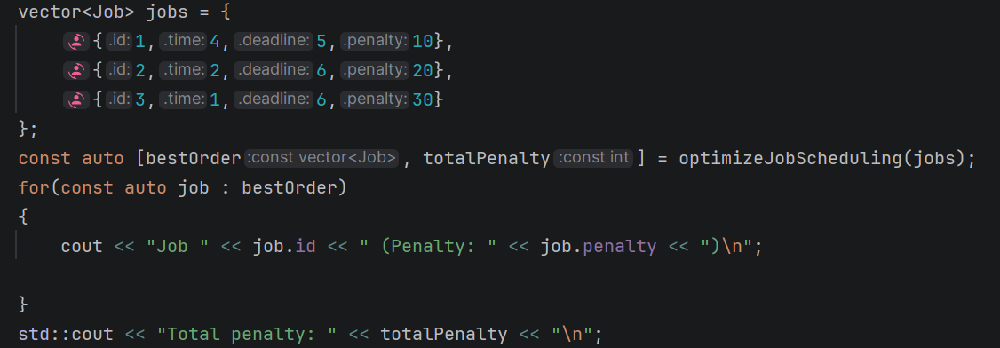 <br> 

**Output:** <br> 

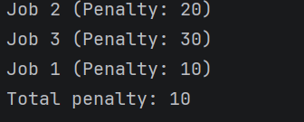 <br> 

##### Test Case 2: <br> 

**Input:** <br> 

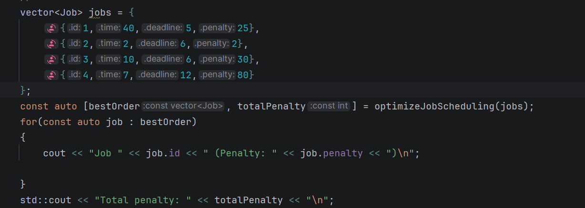 <br>   

**Output:** <br> 

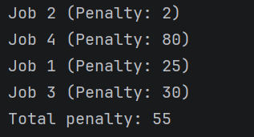 <br> 

##### Test Case 3: <br>

**Input:** <br> 

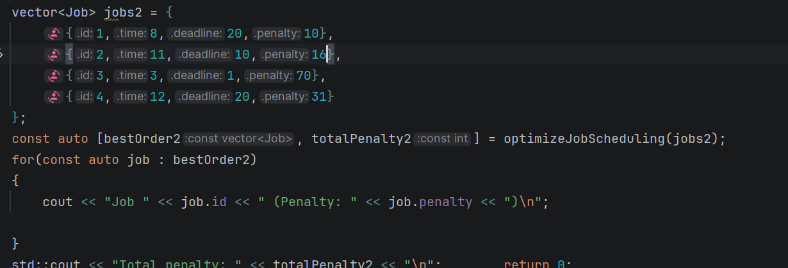 <br> 

**Output:** <br>  

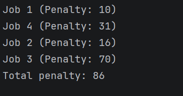 <br> 

##### Test Case 4: <br> 

**Input:** <br>   

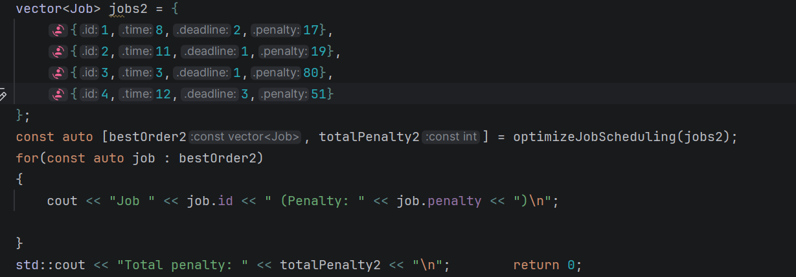 <br>   

**Output:** <br>   

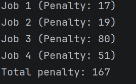 <br> 
### Dynamic Programming Method
We first sort the jobs by their deadlines (Earliest Deadline First – EDF). We define $dp[i][t]$ as the minimum penalty incurred when considering the first $i$ jobs, and they finish by time $t$.

#### Pseudocode
```text
Sort jobs by deadline d_i
TotalTime = sum of all t_i
Initialize DP[n+1][TotalTime+1] with 0

for i from 1 to n:
    for t from 0 to TotalTime:
        // Option 1: Job i is late (Penalty incurred)
        skipPenalty = jobs[i-1].penalty + DP[i-1][t]
        
        // Option 2: Job i is on time (Must finish by d_i and current time t)
        doPenalty = Infinity
        if t >= jobs[i-1].time AND t <= jobs[i-1].deadline:
            doPenalty = DP[i-1][t - jobs[i-1].time]
            
        DP[i][t] = min(skipPenalty, doPenalty)
        if t > 0:
            DP[i][t] = min(DP[i][t], DP[i][t-1])
```

#### Implementation Code
```cpp
void optimizeJobScheduling(vector<Job>& jobs)
{
    sort(jobs.begin(), jobs.end());
    int total_time=0;
    for(const auto j: jobs)total_time+=j.time;
    vector dp{size + 1, vector<int>(total_time + 1, 0)};
    for (int i = 1; i <= size; ++i) {
        const int p_i = jobs[i-1].penalty;
        const int t_i = jobs[i-1].time;
        const int d_i = jobs[i-1].deadline;
        for (int t = 0; t <= total_time; ++t) {
            int skipPenalty = p_i + dp[i-1][t];
            int doPenalty = 2e9;
            if (t >= t_i && t <= d_i) {
                doPenalty = dp[i-1][t - t_i];
            }
            dp[i][t] = min(doPenalty,skipPenalty);
            if (t > 0) dp[i][t] = min(dp[i][t], dp[i][t-1]);
        }
    }
}
```

#### Step By Step Description
1. Sort jobs by deadline.
2. Build a table where each row represents a job and each column represents the time.
3. For each cell, decide whether to include the job in the "on-time" set (if time allows) or the "late" set.
4. The value in each cell represents the minimum penalty for that state.
5. Backtrack from the bottom-right of the table to find which jobs were scheduled on-time.

#### Time and Space Complexity Analysis
- **Time Complexity:** $O(n \cdot \sum t_i)$, where $n$ is the number of jobs and $\sum t_i$ is the total processing time.
- **Space Complexity:** $O(n \cdot \sum t_i)$ to store the DP table.

#### Test Cases <br> 

##### Test Case 1 <br>    

**Input:** <br>   

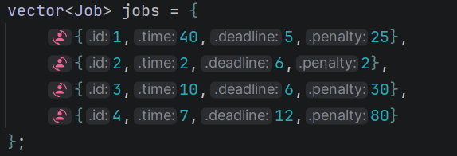 <br>  

**Output:** <br>     

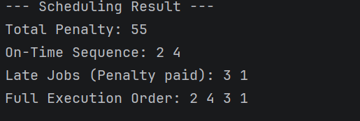 <br>

##### Test Case 2 <br> 

**Input:** <br>   

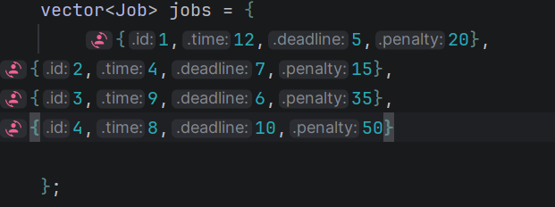 <br>   

**Output:** <br>   

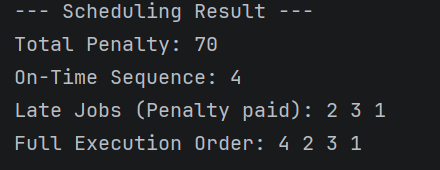 <br>   

##### Test Case 3 <br>   

**Input:** <br>   

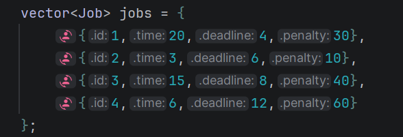 <br>   

**Output:** <br>   

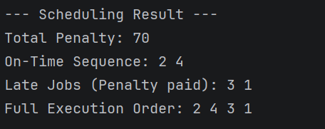 <br>   

##### Test Case 4 <br>   

**Input:** <br>    

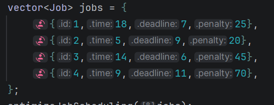 <br>    

**Output:** <br>   

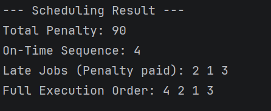 <br> 

### Divide & Conquer Method
This problem is solved using a recursive backtracking approach (a form of state-space search) that divides the problem into subproblems: for each job, we either process it on-time or we process it late.

#### Pseudocode
```text
Procedure Solve(index, currentTime, currentSavedPenalty):
    if index == n:
        if currentSavedPenalty > maxSaved:
            maxSaved = currentSavedPenalty
        return

    // Option 1: Job is late
    Solve(index + 1, currentTime, currentSavedPenalty)

    // Option 2: Job is on-time (if possible)
    if currentTime + jobs[index].time <= jobs[index].deadline:
        Solve(index + 1, currentTime + jobs[index].time, currentSavedPenalty + jobs[index].penalty)
```

#### Implementation Code
```cpp
static void DCHelper( vector<Job>& jobs,
    const int i,
    const int currentTime,
    const int savedPenalty,
    vector<char>& currentTake,
    const int remainingPenaltySum,
    DCState& state) {
    if (savedPenalty + remainingPenaltySum <= state.bestSavedPenalty)return;
    if (i == static_cast<int>(jobs.size())) {
        if (savedPenalty>state.bestSavedPenalty) {
            state.bestSavedPenalty = savedPenalty;
            state.bestTake = currentTake;
        }
        return;
    }
    // Option 1: skip job i -> late
    currentTake[i]=0;
    DCHelper(jobs,i+1,currentTime,savedPenalty,currentTake,remainingPenaltySum-jobs[i].penalty,state);
    
    // Option 2: take job i on time if the deadline allows
    if (currentTime+jobs[i].time <= jobs[i].deadline) {
        currentTake[i] = 1;
        DCHelper(jobs, i+1, currentTime+jobs[i].time, savedPenalty+jobs[i].penalty, 
                 currentTake, remainingPenaltySum-jobs[i].penalty, state);
    }
}
```

#### Step By Step Description
1. Sort jobs by deadline (EDF).
2. Recursively explore two branches for each job: include in on-time set or exclude.
3. Prune branches where the potential saved penalty cannot exceed the current best.
4. When all jobs are considered, update the global maximum saved penalty.
5. Total penalty = (Sum of all penalties) - (Maximum saved penalty).

#### Time and Space Complexity Analysis
- **Time Complexity:** $O(2^n)$ in the worst case (unpruned binary tree).
- **Space Complexity:** $O(n)$ for the recursion stack.

#### Test Cases <br> 

##### Test Case 1 <br> 

**Input:** <br>  

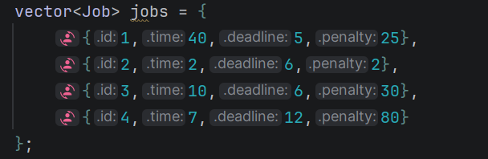 <br> 

**Output:** <br> 

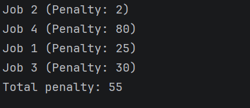 <br>   

##### Test Case 2 <br> 

**Input:** <br> 

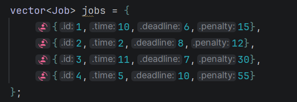 <br> 

**Output:** <br> 

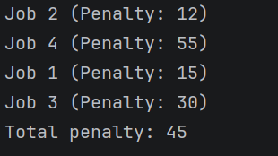 <br> 

##### Test Case 3 <br> 

**Input:** <br> 

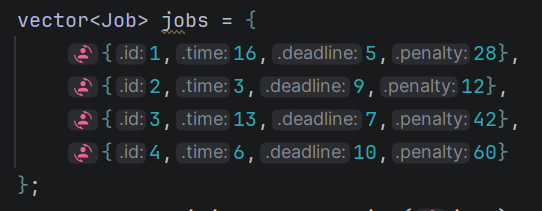 <br> 

**Output:** <br> 

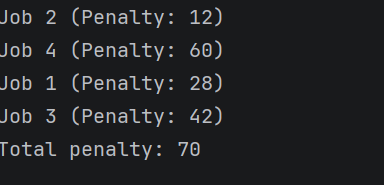 <br> 

##### Test Case 4 <br>  

**Input:** <br> 

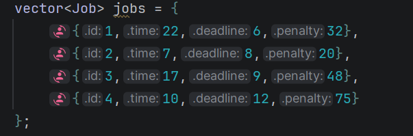 <br> 

**Output:** <br> 

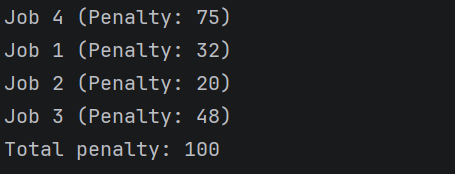 <br> 
## Comparative Evaluation
| Feature        | Brute Force                | Dynamic Programming          | Divide & Conquer (Backtracking) |
|:---------------|:---------------------------|:-----------------------------|:--------------------------------|
| **Optimality** | Guaranteed                 | Guaranteed                   | Guaranteed                      |
| **Efficiency** | Very Low ($O(n \cdot n!)$) | High ($O(n \cdot \sum t_i)$) | Medium ($O(2^n)$)               |
| **Best For**   | Very small $n$ ($n < 10$)  | Small $t_i$, larger $n$      | Medium $n$, high $t_i$          |
| **Complexity** | Simple                     | Moderate                     | Moderate                        |

## Extended Analysis & Alternative techniques
- **Greedy approach:** While a simple greedy approach (e.g., sorting by penalty) doesn't always yield the optimal solution, it can be used for approximation.
- **Moore-Hodgson Algorithm:** An $O(n \log n) $ algorithm specifically designed for minimizing the number of late jobs (when all penalties are equal).
- **Branch and Bound:** Can significantly improve the performance of the backtracking approach by using more sophisticated pruning.

## Key Findings and Insights
1. **EDF Sorting:** Sorting jobs by their deadlines is a crucial preprocessing step for both DP and recursive approaches in this problem.
2. **Penalty vs. Time:** The DP approach's efficiency is highly dependent on the total processing time, making it a "pseudo-polynomial" time algorithm.
3. **Pruning Effectiveness:** In the Divide & Conquer (Backtracking) approach, effective pruning can drastically reduce the search space, making it viable for larger $n$ than pure brute force.

# Task08 – _(Insert Description)_


# Task09 – _(Insert Description)_


# Task10 – _(Insert Description)_

# References
[1] Moore, J. M. (1968). An n job, one machine sequencing algorithm for minimizing the number of late jobs. Management Science.
